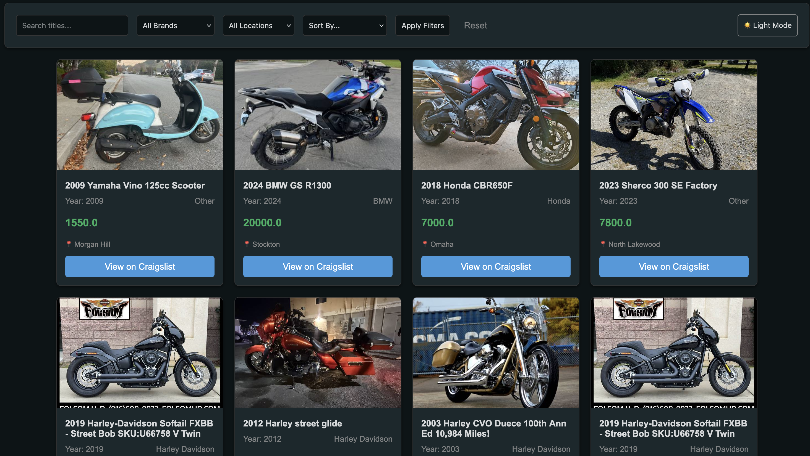

# Stealth Web Scraper

A browser-emulating web scraper that extracts listing data from protected websites and presents it in a clean, sortable web interface.

## Overview

This project is designed to:
- Mimic real browser behavior to reduce blocking on sites with basic anti-scraping protections
- Collect structured listing data
- Display results in a simple web UI that is easy to sort, filter, and explore

The focus is on reliability, clarity, and usability rather than aggressive scraping.

## Features

- Browser-like scraping logic
- Supports pages with basic security measures
- Clean separation between scraping, data storage, and presentation
- Lightweight web interface for viewing and sorting listings

## Demo

  

